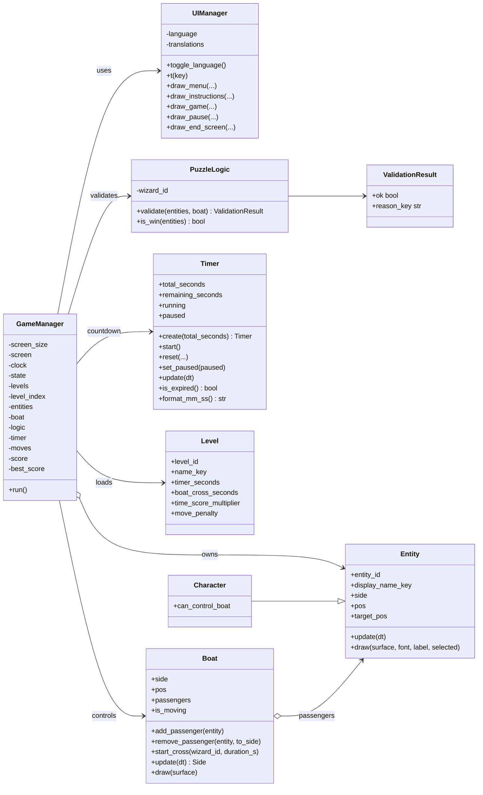

# UML Class Diagram (Text)

```mermaid
classDiagram
    direction LR

    class GameManager {
      -screen_size
      -screen
      -clock
      -state
      -levels
      -level_index
      -entities
      -boat
      -logic
      -timer
      -moves
      -score
      -best_score
      +run()
    }

    class UIManager {
      -language
      -translations
      +toggle_language()
      +t(key)
      +draw_menu(...)
      +draw_instructions(...)
      +draw_game(...)
      +draw_pause(...)
      +draw_end_screen(...)
    }

    class PuzzleLogic {
      -wizard_id
      +validate(entities, boat) ValidationResult
      +is_win(entities) bool
    }

    class ValidationResult {
      +ok bool
      +reason_key str
    }

    class Timer {
      +total_seconds
      +remaining_seconds
      +running
      +paused
      +create(total_seconds) Timer
      +start()
      +reset(...)
      +set_paused(paused)
      +update(dt)
      +is_expired() bool
      +format_mm_ss() str
    }

    class Level {
      +level_id
      +name_key
      +timer_seconds
      +boat_cross_seconds
      +time_score_multiplier
      +move_penalty
    }

    class Entity {
      +entity_id
      +display_name_key
      +side
      +pos
      +target_pos
      +update(dt)
      +draw(surface, font, label, selected)
    }

    class Character {
      +can_control_boat
    }

    class Boat {
      +side
      +pos
      +passengers
      +is_moving
      +add_passenger(entity)
      +remove_passenger(entity, to_side)
      +start_cross(wizard_id, duration_s)
      +update(dt) Side
      +draw(surface)
    }

    GameManager --> UIManager : uses
    GameManager --> PuzzleLogic : validates
    GameManager --> Timer : countdown
    GameManager --> Boat : controls
    GameManager --> Level : loads
    GameManager o--> Entity : owns
    Character --|> Entity
    PuzzleLogic --> ValidationResult
    Boat o--> Entity : passengers
```

